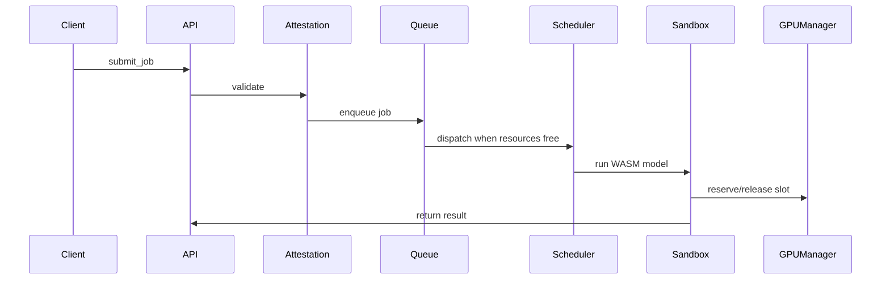

# 🧱 Rust GPU Sandbox Controller — 14-Day Intensive Plan

## Overview

A structured two-week roadmap to build a **Rust-based GPU job orchestration microservice** with:

* job queueing
* multi-tenant scheduling
* virtual GPU resource modeling
* WASM sandboxing
* mocked attestation
* observability
* ML inference integration

Each day includes **theory + development tasks**.

---

## Week 1 — Foundations & Core Service

---

## **Day 1 — Project Setup & Service Foundations**

### **Theory**

**Modern service architecture**

* Service layers: API → logic → runtime → storage → observability
* Async I/O as the concurrency backbone
* Rust’s reactor model (Tokio)
* `Send`/`Sync` and memory safety in async workflows

**Resources:**

* Tokio Tutorial
* Axum Book

### **Dev Tasks**

* Create project: `gpu-sandboxd`
* Add Axum or Tonic
* Implement `submit_job` API endpoint
* Define job struct: `tenant_id`, `model_id`, `payload`, `capabilities`

---

## **Day 2 — Job Queueing & Backpressure**

### **Theory**

**Scheduling 101**

* FIFO vs priority queues
* Backpressure and overload protection
* Why queues prevent cascading failures

**Mental model:** GPU scheduling behaves like airport runway allocation.

### **Dev Tasks**

* Add queue (`tokio::mpsc`)
* Add max queue length → reject or return “queued”
* Implement dispatcher pulling jobs from queue
* Add metadata + status tracking

---

## **Day 3 — Virtual GPU Resource Manager**

### **Theory**

**Multi-tenancy concepts**

* MIG-style GPU partitioning
* Soft vs hard partitioning
* Per-tenant quotas
* GPU slots as resources

### **Dev Tasks**

* Add `GpuManager` with N virtual slots
* Reserve/release slots per job
* Enforce per-tenant concurrency limits
* Integrate with dispatcher

---

## **Day 4 — WASM Sandbox Integration**

### **Theory**

**Capability-based isolation**

* WASM as a lightweight secure execution environment
* Restricting accessible host functions
* Difference between syscall isolation & capability isolation

### **Dev Tasks**

* Add Wasmtime
* Write minimal WASM guest module (e.g. vector add)
* Host: load module → pass input → execute → return output
* Connect WASM execution to job executor

---

## **Day 5 — Tenant Identity & Capabilities**

### **Theory**

**Multi-tenant cloud security**

* Authentication vs authorization
* Capability sets defining allowed actions
* Restricting GPU actions per tenant

### **Dev Tasks**

* Add tenant registry
* Parse capability list in job request
* Enforce capabilities before queueing
* Add structured error handling
* Optional: per-tenant rate limits

---

## **Day 6 — Mock Attestation Flow**

### **Theory**

**Attestation essentials**

* Measured boot
* Signed job requests
* Model hashing
* Attestation reports

### **Dev Tasks**

* Implement `validate_attestation(job)`

  * verify model hash
  * verify tenant signature (HMAC)
* Produce attestation report struct
* Reject unauthentic jobs *before* queueing

---

## **Day 7 — Observability & Metrics**

### **Theory**

**Observability in distributed systems**

* Logging vs tracing vs metrics
* Spans for job lifecycle
* Prometheus-style telemetry

### **Dev Tasks**

* Add `tracing` with spans
* Add metrics:

  * queue_length
  * gpu_slot_utilization
  * job_run_latency
* Add `/metrics` endpoint
* Week 1 milestone: working service baseline

---

# Week 2 — Refinement, Scheduling, Stability & ML Integration

---

## **Day 8 — Realistic Execution Pipeline**

### **Theory**

**AI runtime execution flow**

* Model load → preprocessing → kernel run → postprocessing
* Why GPU compute pipelines are asynchronous and staged

### **Dev Tasks**

Choose execution backend:

**Option A (simple):**

* Implement tiny Rust MLP for CPU inference

**Option B (more realistic):**

* Integrate `tract` for ONNX
* Run tiny model (MNIST / toy MLP)

Wire this into sandboxed execution.

---

## **Day 9 — Failure Modes & Lifecycle State Machine**

### **Theory**

**Failure handling in distributed/GPU systems**

* Timeouts
* Cancellation
* Idempotency
* Lease/lock cleanup
* Handling partial failures

### **Dev Tasks**

* Add job states: Pending → Running → Finished → Failed
* Timeout watchdog for job execution
* Automatic slot release on crash
* Add cancellation tokens

---

## **Day 10 — CLI or Dashboard for Job Submission**

### **Theory**

**Operational tooling**

* Why infra teams write CLIs
* Dashboard ergonomics
* Clear interfaces for debugging distributed systems

### **Dev Tasks**

Pick one:

**CLI:**

* `submit-job`
* `check-status`
* `list-jobs`

**Dashboard:**

* queue view
* GPU slot usage
* job history

(Note: highly portfolio-friendly.)

---

## **Day 11 — Scheduling Policy Engine**

### **Theory**

**Scheduling algorithms in cloud environments**

* FIFO
* Per-tenant fair queuing
* Weighted round robin
* Work-conserving vs non-work-conserving schedulers
* Why GPUs differ from CPUs in scheduling constraints

### **Dev Tasks**

* Define Scheduler trait
* Implement:

  * FIFO scheduler
  * Fair-share (per-tenant round-robin) scheduler
* Allow switching policies via config

---

## **Day 12 — Hardening & Stability**

### **Theory**

**Production-readiness concepts**

* Graceful shutdown
* Bounded resource usage
* Health checks
* Backoff strategies
* Deterministic behavior under load

### **Dev Tasks**

* Add graceful shutdown across dispatcher + GPU manager
* Add `/health` endpoint
* Improve error types & logging
* Write integration tests:

  * multi-tenant fairness
  * cancellation
  * queue overflow
  * basic sandbox execution

---

## **Day 13 — Documentation & Architecture Diagrams**

### **Theory**

**Writing portfolio-grade documentation**

* Clear component boundaries
* Trade-off explanations
* Sequence diagrams
* Why diagrams sell systems thinking

### **Dev Tasks**

Write documentation sections:

* Overview
* Architecture
* Security model
* Scheduling model
* Install & usage guide
* Example workflow

Add diagrams (Mermaid recommended):

**Example: job lifecycle**

---

## **Day 14 — Final Polish & Optional GPU Integration**

### **Theory**

**Real hyperscaler GPU orchestration**

* Kubernetes device plugins
* GPU telemetry via DCGM
* Heartbeats & utilization checks

### **Dev Tasks**

* Clean module layout and interfaces
* Add examples
* Add benchmarks (optional)
* Optional wow-factor:

  * add actual CUDA kernel execution backend
  * let API choose backend: WASM / CPU / CUDA

**End Result:**
A polished, realistic, multi-component Rust project that strongly signals readiness for cloud GPU infrastructure roles.